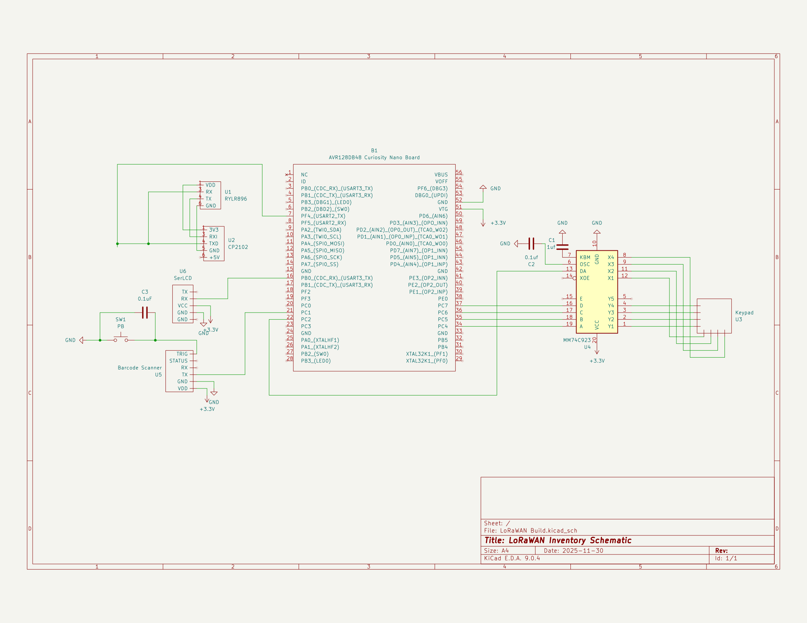

ESE 280 — Lab 12 LoRaWAN Inventory — Andy Xie

A small AVR assembly firmware for an **AVR128DB48** that turns the board into a
handheld inventory terminal. The operator enters a quantity on a matrix keypad,
scans a barcode with a serial scanner, and the unit transmits a formatted
`AT+SEND` packet over UART to a RYLR998-style LoRa module, which forwards it to
a base station listening on address `100`.

```text
+---------+        +---------------+        +-------------+        +----------+
|  Keypad | --PE-> |               | --PB-> |   2x20 LCD  |        |   Base   |
+---------+        |  AVR128DB48   |        +-------------+        | Station  |
+---------+        |    @ 4 MHz    |        +-------------+        |(addr 100)|
| Barcode | --PC-> |               | --PF-> | LoRa Module | <-RF-> +----------+
| Scanner |        +---------------+        +-------------+
+---------+
```

## Schematic



## Operation

1. The LCD shows a cover page (`Inventory System I` / `ESE280 Fall 2025` /
   `<Andy Xie>`) for ~1 s on power up.
2. The screen switches to:
   ```
   Enter item count:
   __
   Scan barcode:
   ```
3. The operator types 1 or 2 digits on the keypad. The digits are echoed to
   the LCD and stored.
4. The operator presses **ENTER** (`0x0C` on the keypad) once the quantity is
   correct.
5. The operator scans a barcode. Bytes are streamed in over USART1 and echoed
   to the LCD on line 3 until the scanner sends a `CR` (`0x0D`).
6. The operator presses **ENTER** again. The firmware builds:
   ```
   AT+SEND=100,<len>,Count = <NN>, ID = <barcode>\r\n
   ```
   and sends it out over USART2 to the LoRa module.
7. Control returns to step 2 so the next item can be entered.

## Hardware

| Peripheral        | Pin / Port        | UART    | Baud (@ 4 MHz)         |
|-------------------|-------------------|---------|------------------------|
| LCD (Serial)      | PB0 (TX)          | USART3  | 9600 (`BAUD = 1667`)   |
| Barcode scanner   | PC1 (RX)          | USART1  | 115200 (`BAUD = 139`)  |
| LoRa radio        | PF0 (TX)          | USART2  | 115200 (`BAUD = 139`)  |
| Matrix keypad     | PE3 (row IRQ), PC4-PC7 (columns) | --- | -- |

CPU clock is assumed to be the post-reset 4 MHz internal oscillator (no clock
fuses or `CLKCTRL` writes are performed).

### Keypad encoding

The keypad ISR reads `VPORTC_IN`, shifts the top nibble to the bottom, and
indexes into the following lookup table to produce a key code:

| Raw index | Key       | Code         |
|-----------|-----------|--------------|
| 0..2      | 1,2,3     | `0x01..0x03` |
| 3         | F         | `0x0F`       |
| 4..6      | 4,5,6     | `0x04..0x06` |
| 7         | E         | `0x0E`       |
| 8..10     | 7,8,9     | `0x07..0x09` |
| 11        | D         | `0x0D`       |
| 12        | A         | `0x0A`       |
| 13        | 0         | `0x00`       |
| 14        | B         | `0x0B`       |
| 15        | **ENTER** | `0x0C`       |

## Build & Flash

The source is single-file AVR assembly. Build with **Microchip Studio**
(formerly Atmel Studio) — the standard environment for `avrasm2` and the
`avr128db48def.inc` device header.

### Microchip Studio

1. *File ▸ New ▸ Project ▸ GCC C Executable* (or *Assembler*) *Project*.
2. Choose **AVR128DB48** as the device.
3. Replace the generated source with [`main.asm`](main.asm).
4. *Build ▸ Build Solution* (`F7`).
5. Connect the programmer (Atmel-ICE / PICkit / SNAP) and *Debug ▸ Start
   Without Debugging* (`Ctrl+Alt+F5`), or use *Tools ▸ Device Programming*
   to flash `main.hex`.


## Memory map (SRAM)

```text
page_1_buff       : 80 bytes  ; LCD cover page
page_2_buff       : 80 bytes  ; LCD entry page (4 x 20)
number            :  2 bytes  ; Raw keypad digits (0..9)
scanned_data      : 40 bytes  ; Barcode (terminated by CR)
unsigned_val      :  1 byte   ; Parsed quantity (0..99)
tx_buff           : 100 bytes ; Full "AT+SEND=..." command
payload_buff      : 60 bytes  ; Payload only ("Count = NN, ID = ...")
tx_ptr            :  2 bytes  ; Current TX pointer for USART2 ISR
last_key_pressed  :  1 byte   ; Last decoded key (polled by main)
```

## Interrupt vectors

| Vector             | Source                | Handler                 |
|--------------------|-----------------------|-------------------------|
| `PORTE_PORT_vect`  | Keypad row IRQ (PE3)  | `porte_isr`             |
| `USART1_RXC_vect`  | Scanner byte received | `USART1_RXC_ISR` (stub) |
| `USART2_DRE_vect`  | LoRa TX buffer empty  | `USART2_DRE_ISR`        |
| `USART3_DRE_vect`  | LCD TX buffer empty   | `USART3_DRE_isr`        |

## Known limitations

- The 4 MHz / 115200 baud calculation rounds to `BAUD = 139` (≈ 0.16% off
  ideal). Within tolerance for typical UART receivers, but if the LoRa
  module proves picky, switch to a higher `CLK_PER` and recompute.
- `convert_str_to_unsign` uses `r22` as the digit count. The keypad ISR
  fills `number` (2 bytes) and bumps `r22`; entering more than two digits
  will run past the buffer. Either cap input in the ISR or grow the
  buffer if longer counts are needed.
- `int_to_ascii` writes exactly two ASCII digits, so payload lengths must
  be `< 100`. The current packet format stays well below that.
